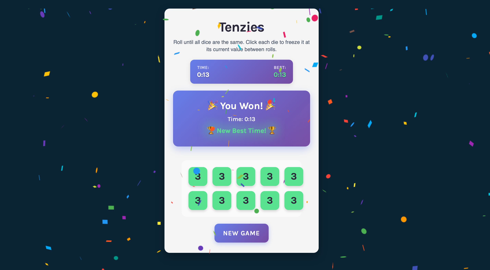

# Tenzies Game 🎲

A fun and interactive dice game built with React! Roll the dice until all 10 dice show the same number. Click on dice to "hold" them and prevent them from rolling on subsequent turns.

Screenshot


- Live Site URL: [live site](https://rllz0.github.io/tenzies-react/)

## 🎮 How to Play

1. **Start the Game**: Click any die to begin the timer
2. **Roll the Dice**: Click the "Roll" button to roll all unheld dice
3. **Hold Dice**: Click on individual dice to hold them at their current value
4. **Win Condition**: Get all 10 dice to show the same number
5. **Victory**: Celebrate with confetti and see if you beat your best time!

## ✨ Features

- **Timer System**: Track your completion time with a real-time timer
- **Best Time Tracking**: Your fastest completion time is saved and displayed
- **Interactive Dice**: Click dice to hold/unhold them with visual feedback
- **Confetti Celebration**: Animated confetti when you win
- **Accessibility**: Screen reader support and proper ARIA labels
- **Responsive Design**: Works great on desktop and mobile devices
- **Smooth Animations**: Beautiful hover effects and transitions

## 🛠️ Technologies Used

- **React** - Frontend framework with hooks (useState, useEffect, useRef)
- **CSS** - Modern styling with gradients, animations, and responsive design
- **JavaScript** - Game logic and state management
- **Nanoid** - Unique ID generation for dice components
- **React Confetti** - Celebration animations

## 📋 Project Structure

```
tenzies-game/
├── src/
│   ├── App.jsx          # Main game component with state management
│   ├── Die.jsx          # Individual die component
│   ├── index.jsx        # React app entry point
│   └── index.css        # All styling and animations
├── public/
└── README.md
```

## 🚀 Getting Started

### Prerequisites

- Node.js (version 14 or higher)
- npm or yarn package manager

### Installation

1. **Clone the repository**

   ```bash
   git clone https://github.com/rlz0/tenzies-react.git
   cd tenzies-react
   ```

2. **Install dependencies**

   ```bash
   npm install
   # or
   yarn install
   ```

3. **Start the development server**

   ```bash
   npm start
   # or
   yarn start
   ```

4. **Open your browser**
   Navigate to `http://localhost:3000` to play the game!

### Dependencies

```json
{
  "react": "^18.0.0",
  "react-dom": "^18.0.0",
  "nanoid": "^4.0.0",
  "react-confetti": "^6.1.0"
}
```

## 🎯 Game Mechanics

### State Management

- **Dice Array**: Each die has a value (1-6), held status, and unique ID
- **Game Timer**: Tracks elapsed time in tenths of seconds
- **Best Time**: Persists your fastest completion time
- **Game Status**: Tracks if game has started and win condition

### Key Functions

- `generateAllNewDice()`: Creates 10 new dice with random values
- `rollDice()`: Rolls all unheld dice or starts new game
- `hold(id)`: Toggles the held status of a specific die
- `formatTime()`: Converts timer to MM:SS format

## 🎨 Styling Features

- **Gradient Backgrounds**: Beautiful color gradients throughout the UI
- **Hover Effects**: Interactive animations on dice and buttons
- **Responsive Grid**: Dice arranged in a 5x2 grid that adapts to screen size
- **Glass Morphism**: Semi-transparent backgrounds with blur effects
- **Smooth Transitions**: CSS transitions for all interactive elements

## 📱 Responsive Design

The game is fully responsive and includes:

- Mobile-first design approach
- Breakpoints for tablets and phones
- Touch-friendly button sizes
- Adaptive layouts for different screen sizes

## ♿ Accessibility Features

- **Screen Reader Support**: Announcements for game state changes
- **ARIA Labels**: Proper labeling for dice and interactive elements
- **Keyboard Navigation**: Focus management for better keyboard access
- **High Contrast**: Good color contrast ratios for readability

## 🎓 Learning Journey

This project was built while learning React through **Scrimba's React course**. It demonstrates:

- React hooks (useState, useEffect, useRef)
- Component composition and props
- Event handling and state management
- Accessibility best practices

## 🚀 Potential Enhancements

- [ ] Add difficulty levels (different grid sizes)
- [ ] Implement local storage for persistent best times
- [ ] Add sound effects
- [ ] Include game statistics (games played, average time)
- [ ] Add multiplayer functionality
- [ ] Include different dice themes

## 🙏 Acknowledgments

- **Scrimba** - For the excellent React course that taught me the fundamentals
- **React Community** - For the amazing tools and libraries
- **Tenzies** - The original dice game that inspired this digital version

---

**Happy Rolling! 🎲✨**
